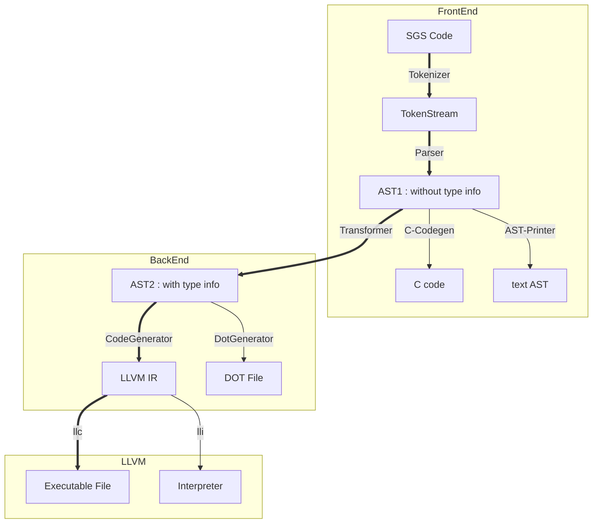
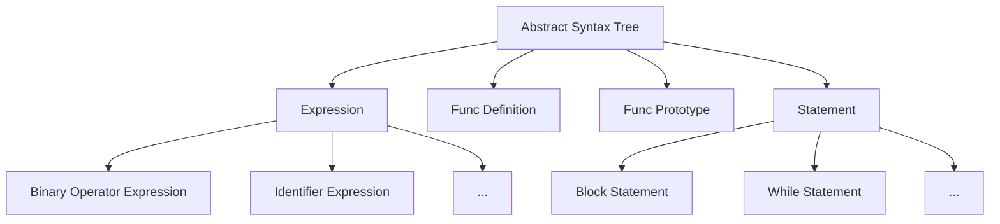
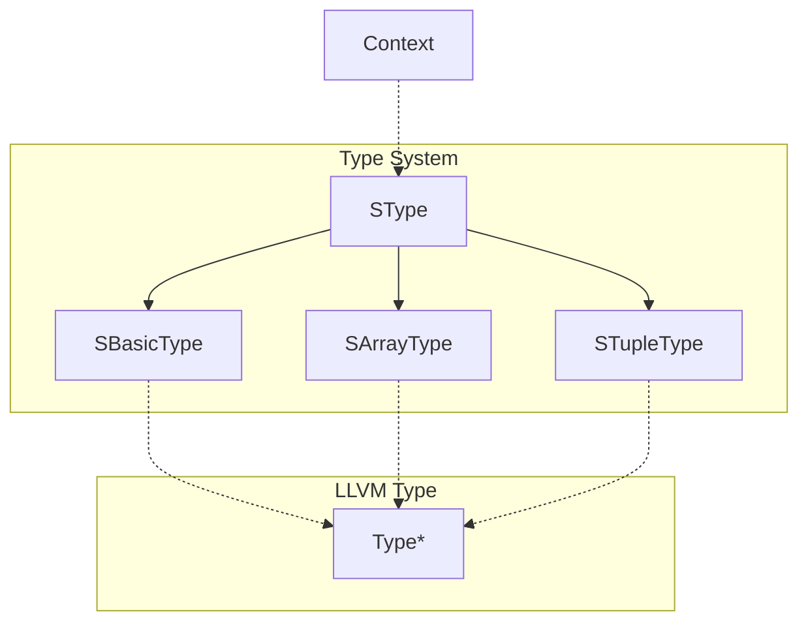

# SGS 编译器文档

[TOC]

---
## 前言

​	

### 项目概览

## SGS 语言手册

### SGS 语言简介

​	SGS语言为一款轻量级程序设计语言，具有很强的可移植性和可扩展性。目前开发团队已经完成 SGS 编译器及解释器，使其可以覆盖各类应用场景的需求。

​	在编译器前端，SGS 侧重编程语言与自然语言的相似度，使得 SGS 代码更接近于英语，从而可以让绝大多数人们可以理解其内部含义。在编译器后端，SGS 侧重对象的处理与类型系统的维护。在 SGS 中，非基本类型的变量全部作为对象处理。这样的好处是避免了指针的使用，从而让 SGS 代码更加安全。

### SGS 语言语法

SGS语法与英语有很大相似度。

- 变量声明与赋值语句：`let <type> <var> [be <exp>].`

  其中 `let` 和 `be` 为关键字（ `be` 及其后 `<exp>` 可省），`<type>`为变量类型，`<var>`为变量名字。若变量已声明过，则省略type。

- 函数声明语句：`new function <name> [with <type1> <para1>, <type2> <para 2>... ] return <type>. `

  其中 `new`、`function`、`with` 和 `return` 为关键字，`name` 为函数名，`<type1>`、`<para1>` 及其后的 `<type>` 和 `<para>` 为参数的类型和名字，若无参数，则省略 `with` 及其与 `return` 之间的内容。`<type>` 为函数返回值，若无返回值，则省略 `return` 及其后内容。

- 函数定义语句 `start <name>. <block>. end <name>.`

   其中 `start` 和 `end `为关键字，`<name>` 为函数名。在 `<block>` 中定义函数主体，SGS 默认为每个有返回值的函数定义一个名为 `result` 的局部变量。

- 类声明语句 `new class <name> with <type1> <para1>[, <type2> <para2>...]` 

  其中 `new` 、`class` 和 `with` 为关键字，`<name>` 为类名，`type1` 、`para1` 及其后的 `type2` 和 `para2` 为内部成员变量的类型和名字。

- 函数调用语句 `<func> with <para1> <exp1>, <para2> <exp2> ...`  , `<func> with <exp1>, <exp2>...`

  其中 `with` 为关键字，`<func>` 为函数名。SGS 函数调用支持两种方式：显式参数传递与隐式参数传递。第一种为显式参数传递，`<para1>` 为形参，`<exp1>` 为实参，此种传参方式支持乱序，即参数顺序不必与声明顺序一致。第二种为隐式参数传递，`<exp1>` 为实参，此种方式与 C 类似，参数顺序必须与声明顺序一致。

- 分支语句 `if <exp> then <block>[ else <block>] end if.`

   其中`if` 、`then` 、`else` 和 `end` 为关键字，`<exp>` 为判断条件，`<block>` 为语句块。如果判断条件为真的话，执行 `then` 后的 `<block>` 。

- 循环语句 `loop when <exp> <block> end loop.`

   其中 `loop` 、`when` 和 `end` 为关键字，`<exp>` 为判断条件，`<block>` 为语句块。当判断条件为真时循环执行语句块，否则跳出循环。

- 跳转语句 `return | break | continue` 

   SGS中一共三种直接跳转语句，`return` 为跳出函数体，`break` 为跳出循环体，`continue` 为重做循环体。

### SGS 语言语义

## 编译器设计

因为 SGS 编译器的目标代码是 LLVM IR，所以我们把从代码到抽象语法树的工作分为编译器的前端，而把对抽象语法树进行语义分析以及生成目标代码作为编译器的后端。

### 通用部分

为了防止编译器前后端工作因为阻塞而导致无意义的时间浪费，决定通过约定好抽象语法树的结构来使前后端工作同时开展。其中作为编译器前后端的桥梁的就是抽象语法树。通过交流我们确定了编译器前端生成的抽象语法树类型 AST1

#### AST1

在代码中， AST1 对应的是 `sgs::AST` 及其派生类组成的一组类型，具体的实现在 "SGS/syntax.h" 中

AST 的结构和语言的定义是一一对应的，语言中的所有结构都会对应于抽象语法树中的一部分。AST1 保存了代码中的大部分有意义的信息，但没有根据代码**分析**出其它的信息，它的作用仅仅是作为一个序列化的代码片段传递到编译器后端。生成的 AST 可能包含许多错误的信息，例如在循环体外的 `break` 或 `continue` 等等，这些错误将在后面的语义分析中找到 。

#### 类型系统实现与 AST2

AST2 是 SGS 编译器后端中主要使用的抽象语法树结构。在编译器前端将代码序列化之后生成的 AST1 会通过一次语义分析转化为 AST2， 并为抽象语法树中所有的表达式添加上类型标注、检查函数（包括内置函数以及二元/一元运算符）的类型匹配情况，检查表达式中是否会发生隐式的类型转换等等。

AST2 和 SGS 编译器后端使用的类型系统类图如下：

类似于 `LLVMContext` 的设计思路，这里所有的类型都由 `Context` 统一进行资源管理，并隐藏 `SType` 的构造函数使用户无法通过使用 `Context` 以外的方法获取到 `SType` 的示例，这也同时能够使类型的比较只需要比较进行指针比较而不需要通过复杂的递归。同时，建立了此类型系统与 LLVM 类型系统之间的映射。

AST2 的结构类似于 AST1， 但在 `Expression` 上标注了结果的类型，用以检查 AST2 结构的合理性。对于非法的整数与浮点数之间的类型转换会直接抛出异常。标注了类型的 AST2 在转换到 LLVM IR 会更加方便。具体的实现细节会在后文中提到。

### 编译器前端

#### 词法分析

​	SGS 词法分析由确定有限状态机完成。根据 SGS 语言特征，将输出的 token 流分为四类：关键字、用户标识符、操作符以及字面常量。

​	词法分析器读入 SGS 源代码，将输入流连接至词法分析器，然后输出语法分析器所需的 token 流。

​	确定有限状态机一共分为起始状态（接受状态）、读入标识符状态、读入数字状态以及读入符号状态。起始状态与接受状态等价，所以合并为一个状态。当读入一个字符时，进入读入标识符状态，当读入一个数字时，进入读入数字状态，当读入一个符号时，进入读入符号状态。读入标识符状态可能输出关键字或者用户标识符，读入数字状态可能输出数字常量，读入符号装固态可能输出符号或者字符串常量。

​	为了加速词法分析的过程，在字符串匹配的时候分析器使用了哈希算法进行插入与查找，提高了词法分析的效率。

#### 语法分析

​	SGS 语法分析使用 LL(1) 递归下降分析算法完成。

 ### 编译器后端

#### 语义分析

#### 代码生成

### 辅助工具

#### 命令行 AST 输出

#### 生成可执行 C 代码

#### 生成 DOT 文件得到 AST2 图形显示

## 测试

### 简单测试

### 复杂测试

## 后记

### 分工

### 额外说明

