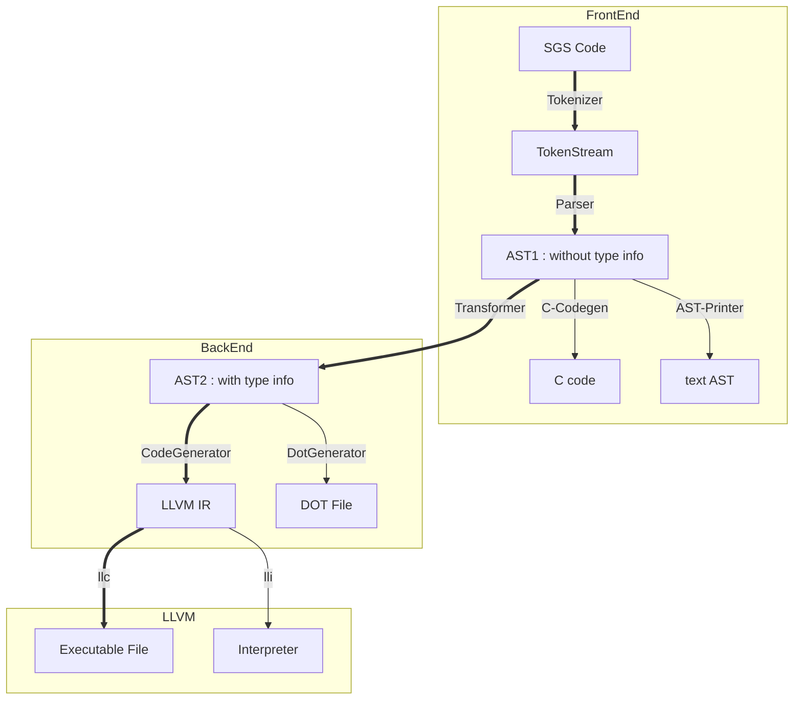
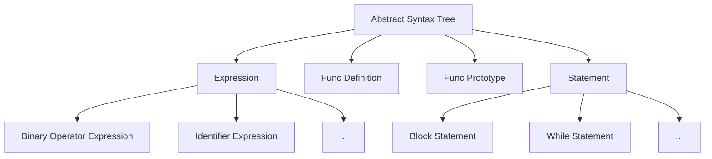
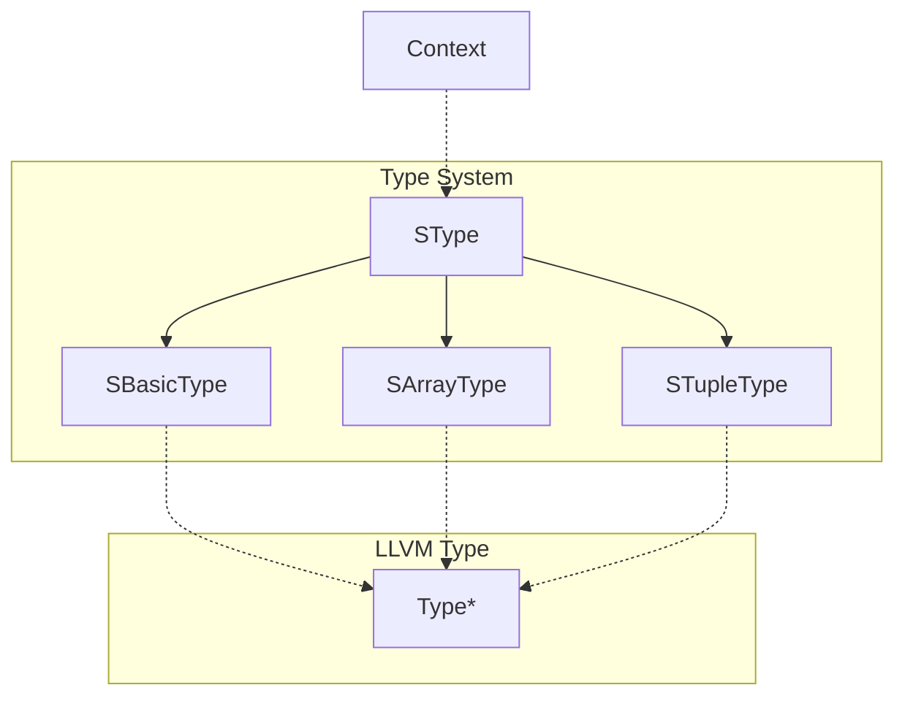
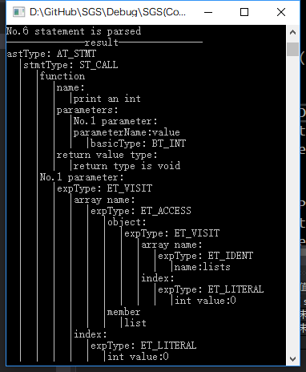

# SGS 编译器文档

[TOC]

---
## 前言

​    

### 项目概览




## SGS 语言手册

### SGS 语言简介

​	SGS语言为一款轻量级程序设计语言，具有很强的可移植性和可扩展性。目前开发团队已经完成 SGS 编译器及解释器，使其可以覆盖各类应用场景的需求。

​	在编译器前端，SGS 侧重编程语言与自然语言的相似度，使得 SGS 代码更接近于英语，从而可以让绝大多数人们可以理解其内部含义。在编译器后端，SGS 侧重对象的处理与类型系统的维护。在 SGS 中，非基本类型的变量全部作为对象处理。这样的好处是避免了指针的使用，从而让 SGS 代码更加安全。

### SGS 语言语法

SGS语法与英语有很大相似度。

- 变量声明与赋值语句：`let <type> <var> [be <exp>].`

  其中 `let` 和 `be` 为关键字（ `be` 及其后 `<exp>` 可省），`<type>`为变量类型，`<var>`为变量名字。若变量已声明过，则省略type。

- 函数声明语句：`new function <name> [with <type1> <para1>, <type2> <para 2>... ] return <type>. `

  其中 `new`、`function`、`with` 和 `return` 为关键字，`name` 为函数名，`<type1>`、`<para1>` 及其后的 `<type>` 和 `<para>` 为参数的类型和名字，若无参数，则省略 `with` 及其与 `return` 之间的内容。`<type>` 为函数返回值，若无返回值，则省略 `return` 及其后内容。

- 函数定义语句 `start <name>. <block>. end <name>.`

   其中 `start` 和 `end `为关键字，`<name>` 为函数名。在 `<block>` 中定义函数主体，SGS 默认为每个有返回值的函数定义一个名为 `result` 的局部变量。

- 类声明语句 `new class <name> with <type1> <para1>[, <type2> <para2>...]` 

  其中 `new` 、`class` 和 `with` 为关键字，`<name>` 为类名，`type1` 、`para1` 及其后的 `type2` 和 `para2` 为内部成员变量的类型和名字。

- 函数调用语句 `<func> with <para1> <exp1>, <para2> <exp2> ...`  , `<func> with <exp1>, <exp2>...`

  其中 `with` 为关键字，`<func>` 为函数名。SGS 函数调用支持两种方式：显式参数传递与隐式参数传递。第一种为显式参数传递，`<para1>` 为形参，`<exp1>` 为实参，此种传参方式支持乱序，即参数顺序不必与声明顺序一致。第二种为隐式参数传递，`<exp1>` 为实参，此种方式与 C 类似，参数顺序必须与声明顺序一致。

- 分支语句 `if <exp> then <block>[ else <block>] end if.`

   其中`if` 、`then` 、`else` 和 `end` 为关键字，`<exp>` 为判断条件，`<block>` 为语句块。如果判断条件为真的话，执行 `then` 后的 `<block>` 。

- 循环语句 `loop when <exp> <block> end loop.`

   其中 `loop` 、`when` 和 `end` 为关键字，`<exp>` 为判断条件，`<block>` 为语句块。当判断条件为真时循环执行语句块，否则跳出循环。

- 跳转语句 `return | break | continue` 

   SGS中一共三种直接跳转语句，`return` 为跳出函数体，`break` 为跳出循环体，`continue` 为重做循环体。

### SGS 语言语义

## 编译器设计

因为 SGS 编译器的目标代码是 LLVM IR，所以我们把从代码到抽象语法树的工作分为编译器的前端，而把对抽象语法树进行语义分析以及生成目标代码作为编译器的后端。

### 通用部分

为了防止编译器前后端工作因为阻塞而导致无意义的时间浪费，决定通过约定好抽象语法树的结构来使前后端工作同时开展。其中作为编译器前后端的桥梁的就是抽象语法树。通过交流我们确定了编译器前端生成的抽象语法树类型 AST1

#### AST1

在代码中， AST1 对应的是 `sgs::AST` 及其派生类组成的一组类型，具体的实现在 "SGS/syntax.h" 中



AST 的结构和语言的定义是一一对应的，语言中的所有结构都会对应于抽象语法树中的一部分。AST1 保存了代码中的大部分有意义的信息，但没有根据代码**分析**出其它的信息，它的作用仅仅是作为一个序列化的代码片段传递到编译器后端。生成的 AST 可能包含许多错误的信息，例如在循环体外的 `break` 或 `continue` 等等，这些错误将在后面的语义分析中找到 。

#### 类型系统实现与 AST2

AST2 是 SGS 编译器后端中主要使用的抽象语法树结构。在编译器前端将代码序列化之后生成的 AST1 会通过一次语义分析转化为 AST2， 并为抽象语法树中所有的表达式添加上类型标注、检查函数（包括内置函数以及二元/一元运算符）的类型匹配情况，检查表达式中是否会发生隐式的类型转换等等。

AST2 和 SGS 编译器后端使用的类型系统类图如下：



类似于 `LLVMContext` 的设计思路，这里所有的类型都由 `Context` 统一进行资源管理，并隐藏 `SType` 的构造函数使用户无法通过使用 `Context` 以外的方法获取到 `SType` 的示例，这也同时能够使类型的比较只需要比较进行指针比较而不需要通过复杂的递归。同时，建立了此类型系统与 LLVM 类型系统之间的映射。

AST2 的结构类似于 AST1， 但在 `Expression` 上标注了结果的类型，用以检查 AST2 结构的合理性。对于非法的整数与浮点数之间的类型转换会直接抛出异常。标注了类型的 AST2 在转换到 LLVM IR 会更加方便。具体的实现细节会在后文中提到。

### 编译器前端

#### 词法分析

​	SGS 词法分析由确定有限状态机完成。根据 SGS 语言特征，将输出的 token 流分为四类：关键字、用户标识符、操作符以及字面常量。

​	词法分析器读入 SGS 源代码，将输入流连接至词法分析器，然后输出语法分析器所需的 token 流。

​	确定有限状态机一共分为起始状态（接受状态）、读入标识符状态、读入数字状态以及读入符号状态。起始状态与接受状态等价，所以合并为一个状态。当读入一个字符时，进入读入标识符状态，当读入一个数字时，进入读入数字状态，当读入一个符号时，进入读入符号状态。读入标识符状态可能输出关键字或者用户标识符，读入数字状态可能输出数字常量，读入符号装固态可能输出符号或者字符串常量。

​	为了加速词法分析的过程，在字符串匹配的时候分析器使用了哈希算法进行插入与查找，提高了词法分析的效率。

#### 语法分析

​	SGS语法分析使用LL(1)递归下降分析算法完成。

​	对于顶层语法分析，可用如下伪代码表示：

```c++
switch(token){
    case new:
        declare();
        break;
    case start:
        function();
        break;
    case let:
        exp();eat(be);exp();
        break;
    case id:
        id();param();
        break;
    case if:
        exp();eat(then);block();eat(else);block();eat(end if);
        break;
    case loop:
        eat(when);exp();block();
        break;
}
```

​	因为顶层代码空间只支持类与函数的定义以及赋值、函数调用、分支和循环语句，所以为这几种情况分配case进行递归下降分析。在分析过程中，会递归用到declare（声明函数或类）、function（函数定义）、exp（表达式）、id（用户标识符）、param（函数参数）、block（语句块）等等。

​	其中会继续递归下降的操作为exp、block。block递归方式与顶层空间类似，不过其禁止函数和类的定义。即，SGS仅支持全局函数和类的声明。exp的语法分析可用如下伪代码表示：

```c++
stack values;
stack ops;
switch(token){
    case id:
        values.push(id);
        break;
    case data:
        values.push(data);
        break;
    case op:
        while(op > ops.top()){
            op1 = ops.pop();
            value1 = values.pop();
            value2 = values.pop();
            values.push(value1 op1 value2);
        }
        ops.push(op);
        break;
    case call:
        value.push(call());
        break;
}
```

​	这样，就完成了语法分析，将输入的token流转化为了AST1。

​	在错误恢复方面，SGS采用了书中的替换策略，即对于可恢复的错误，选择可用的语法来分析更正过的代码，然后增加一条warning消息。对于不可恢复的错误，跳过当前分析行，然后增加一条error消息。这样，代码中的语法错误就不会阻断编译的过程，编译器会扫描全部代码之后给出全部的错误，而非仅仅第一条错误。

​	可恢复的错误如漏掉某特定关键字，或者start和end之后的名称不匹配，这些错误可通过编译器直接替换来完成，这个时候给出warning告诉用户该处进行了某种替换即可。不可恢复的错误如连续多个用户标识符，SGS中无此语法，也无法进行自动替换，这个时候，分析器跳过当前行，给出错误信息。虽然，这样跳过当前行的做法可能会漏掉一小部分语义，但是对后续的语法分析并没有影响，于是SGS最终采取这种错误处理方法。


### 编译器后端

#### 语义分析

经过编译器前端得到的 AST1 中仅仅保存了每个出现的标识符的名字，在语义分析阶段中，我们将对每一个词法作用域（在这里包括所有的 `Block` 和全局空间）建立一个符号表 `Env` 用来保存变量的类型 ：

```c++
class Env {
    Env* parent;
    std::map<string, sgs_backend::SType*> bindings;
public:
    Env(Env* parent) : parent(parent) {}
    void insert(const string& str, sgs_bakend::SType*);
    sgs_backend::SType* find(const string& str);
};
```

由于词法作用域本身是一个嵌套的结构，所以每个环境都会保存它的父环境用来实现跨域访问。同时，通过这种方法也能够实现不同作用域的变量 shadow 。

语义分析是与 AST 转换同时进行的，由于 SGS 本身支持全局作用域下的 `Statement` ，而 LLVM IR 则是通过 `main` 函数入口来执行代码，所以这里需要创建一个单独的 `main` 函数，并将顶层空间中的 `Statement` 全部放在 `main` 函数的 `body` 中。同时，为了消除 `result` 作为函数返回值的语法糖，在创建函数的时候，会在函数的 `body` 的头部插入一个变量定义，并对所有的 `Return Statement` 增加 `result` 这个值。

##### 类型检查

语义分析中的一个关键就是对于类型的检查，由于运算符与函数调用被显式地分开了，所以这里需要完成的类型检查包括：

- 运算符类型检查
- 数组下标访问表达式类型检查
- 结构体成员访问表达式类型检查
- `IfStatement` 条件类型检查
- `WhileStatement` 条件类型检查
- 函数调用参数类型检查

因为 SGS 支持了整数类型之间的隐式类型转换，而没有支持浮点数和整数类型之间的隐式转换，所以在对运算符表达式进行类型检查时需要对浮点数和整数的运算抛出异常； `VisitExp` 需要保证访问的主体的类型为数组，而下标的类型必须为 `Integer` ；`AccessExp` 则要在结构体的复合类型中寻找访问的成员名字，如果没有找到也需要抛出异常。而函数的调用中一个需要考量的点是数组参数的处理方法。在检查类型是否匹配时将只检查数组元素类型而不考虑数组长度。

针对类型转换，我们对二元运算符得到的结果类型单独使用了一个函数进行类型提升：

```c++
sgs_backend::SType* sgs_backend::getBinopType(BINOP op, SType* lhs, SType* rhs, Context& context) {
    switch (op) {
    case AND:
    case OR:
    case GT:
    case LT:
        return context.getBoolType();
    case ADD:
    case SUB:
    case MUL:
    case DIV: {
        assert(lhs->getLevel() == Types::BASIC_TYPE);
        assert(rhs->getLevel() == Types::BASIC_TYPE);
        const auto ls = dynamic_cast<SBasicType*>(lhs);
        const auto rs = dynamic_cast<SBasicType*>(rhs);
        if (ls->getBasicType() == BasicType::FLOAT) {
            return lhs;
        }
        if (ls->getBasicType() == BasicType::INTEGER || rs->getBasicType() == BasicType::INTEGER) {
            return context.getIntType();
        }
        if (ls->getBasicType() == BasicType::CHAR || rs->getBasicType() == BasicType::CHAR) {
            return context.getCharType();
        }
        return lhs;
    }
    default:
        return nullptr;
    }
}
```

#### 代码生成

// TODO

### 辅助工具

#### 命令行 AST 输出

单纯借助IDE（我们使用的是Visual Studio 2017）调试AST1将会困难重重，因为AST树已经存放在内存中，监视某一个AST树的结点需要进行多次强制变量转换才能获取所有细节。这种调试方法既繁琐，又十分容易在调试过程本身犯错。

因此为了让调试AST1的过程更为顺利，同时调试过程本身不出现错误，我们编写了一个命令行输出AST1树的调试工具。具体效果如下：



_本句SGS语言源码为：`print an int with value lists[0]'s list[0].`_

该工具遵循以下逻辑工作（工作思想类似于递归下降法）：

1.  将通过语法分析拿到的AST“ 森林” 传入工具主函数，该森林存储在`vector<sgs::AST *>`这一容器中；
2.  主函数依次访问容器中的每颗AST树，并分析每颗AST树；
3.  主函数在分析一颗AST树时，将先分析该树的根结点的类型`sgs::astType`，以判断当前AST树是什么类型，然后进入不同的处理分支作更进一步分析；
4.  在不同的子处理分支中，当前被分析的根结点将会被`dynamic_cast`为对应分支的类型，并调用相应的子处理函数打印根结点信息。在这之后子处理函数将继续分析根结点的2个child节点，过程类似于步骤3与步骤4。

上述过程将递归进行，直至分析到最底层的AST结点（例如`sgs::BasicType`的对象）为止。

举例说明：如上图，工作过程如下：

1.  本调试工具会首先分析当前AST树的根结点，发现AST种类是`sgs::AST_TYPE::AT_STMT`，调试工具就会进入相应的处理分支
2.  调试工具调用`void dealWithStmtType(sgs::AST *s);`处理当前结点. 将当前结点转化为`sgs::Statement *`后，检查`sgs::Statement::stmtType`，发现当前结点具体种类为`sgs::STMT_TYPE::ST_CALL`。
3.  调试工具于是打印`stmtType: ST_CALL`，并设置缩进增加一格，然后分析当前结点的左child结点与右child结点，重复类似于步骤1、2、3的工作；
4.  当调试工具递归分析到最底层的AST结点后，将只打印最底层的AST结点的信息，而不是试图继续分析左右child结点（因为不存在）；
5.  当调试工具遵循上述4个步骤遍历完一整颗AST树后，该AST树的具体结构也通过命令行的形式可视化的打印出来，此时调试工具将转向分析下一棵AST树，直至`vector<sgs::AST *>`中所有的AST树均被遍历完毕。

借助上述调试工具，我们可以很清晰的看出存放在内存中的AST的结构，当AST存在错误的时候，可以一眼看出错误所在点，进而排除对应bug。

​    

#### 生成可执行 C 代码

#### 生成 DOT 文件得到 AST2 图形显示


## 测试

### 简单测试

### 复杂测试

## 后记

### 分工

### 额外说明

